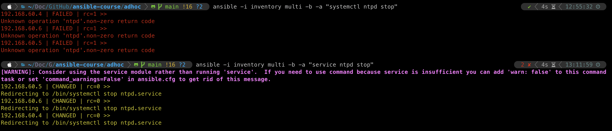

# ansible-course

- `vagrant up` while cd on the folder
- `ansible multi -i inventory -a "hostname"` - change "hostname" to "df -h" or whatever you want to use as adhoc
- `ansible -i inventory db -m setup` - see information about a specific machine - similar to gather facts
- `ansible -i inventory multi -b -m yum -a "name=ntp state=present"` installs a package - we can use --become instead of -b; by default it's root; -K or --ask-become-pass to request a pass to become sudo (by default vagrant user can become sudo, no need to prompt for password - default pass for vagrant user is 'vagrant')
- `ansible -i inventory multi -b -m service -a "name=ntpd state=started enabled=yes"` start the service and enable it

<https://docs.ansible.com/ansible/latest/collections/ansible/builtin/service_module.html>

- `ansible-doc service` - see all information about the service module - if it has a **=** it is mandatory; else, it's optional; same information as the webpage

- `ansible -i inventory multi -b -a "ntpdate -q 0.rhel.pool.ntp.org"` - update, force update of time!
- `ansible -i inventory multi -b -m service -a "name=ntpd state=xxxx`
